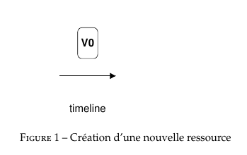
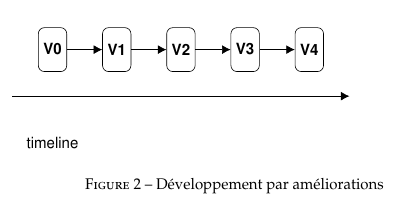

# Projet Git Inside

* Ce projet pourra être subdivisé en plusieurs lots.
* Cette page à vocation à présenter un cahier des charges fonctionnels et techniques 
  pour réaliser la partie technique du partage des ressources pédagogiques.
* Ce projet correspond au design technique de la résolution du ticket :
  https://github.com/PremierLangage/premierlangage/issues/204

## Objectifs globaux du projet

* Centraliser les contributions dans un endroit commun pour favoriser les mutualisations, 
  échanges et les collaborations de manière générale.
* Cacher les détails techniques de sauvegarde et de pérénisation des productions pédagogiques.
* Permmettre une grande flexibilité pour l'utilisateur (ici les enseignants éditeurs) dans les 
  choix de versions.
* Monter en qualité via la mise en place de version de référence pour chaque ressource 
  (à la Wikipédia).

## Decription des fonctionalités utilisateurs

### Versionnage des ressources pédagogiques

Chaque ressource pédagogiques (exercice PL, grader, bilbiothèque fonctionnelle...) aura une 
unique version finale (comme un article wikipedia). Le developpement de chaque ressource sera 
ainsi incrémental dans le sens que la manière normale de travailler est de prendre la dernière
version, de l'améliorer et de publier une nouvelle version.

* À la première création d'une ressource, la première publication est automatiquement la version 
  finale. Chaque modifications entrainera un changement de version finale.
* Il est possible via le "donwgrade", de placer comme nouvelle version finale, une ancienne version.
* L'accès aux anciennes versions est autorisées mais ce n'est pas le point d'entrée naturel.Sauf **Etiquetage**.

Une version d'une ressources pédagogiques n'est pas une version aux sens techniques des utilitaires
informatiques de gestion de version (git, mercurial, subversion, ...). Ici, on enttends par version
un état d'une ressource pédagogique tel qu'à un certain instant, un enseignant éditeur a considéré 
cette ressource comme VALIDE et à donné un label de validité à une version.

Les versions des ressources pédagogiques PL sont donc des versions au sens pédagogiques.

    V0 : premier jet d'un enseignant qui publie son exo car il a fini de travailler dessus
    V1 : correction et reformualtion d'une question de l'énoncé par un autre enseignant
    V2 : l'auteur original change le builder et rajoute de l'aléatoire
    V3 : Un troisième auteur rend l'exercice multi-langue
    V4 : Correction orthographique allemande d'un enseignant Allemand
    ...

On peut imaginer que le saut de V1 à la V2 n'a pas été fait en seule séance de travail car l'auteur
à du débuguer son nouveau builder durant une semaine. Les tentatives de travail de cet enseignant
sont sauvegardée à chaque fois mais n'entre pas dans le versionnage pédagogique. On verra plus tard
que toutes les mini-modifications de cet auteurs ont toutefois déclanchés des commit git en interne.

### Rechercher et ouvrir des ressources

On peut ouvrir une ressource en parcourrant l'arborescence du dépot logique ?

* QUEL EST L'UNITÉ POUR LA RESSOURCE ? 
* PEUT-ON DIRE TOUT FICHIER DU DÉPÔT CONCEPTEXO EST UNE RESSOURCE ?
* UN GRADER EN DEUX FICHIERS CONSTITUE UNE OU DEUX RESSOURCES ?
* QUELQU'UN QUI OUVRE UN FICHIER DE CONCEPTEXO OUVRE QUOI ALORS ?
* PEUT-ON LAISSER LES FICHIERS EN ACCÈS LIBRE ? SINON, ON ÉDITE QUOI ?

Si un fichier = une ressources :
* permet de laisser les gens se pronemer dans l'arborescence du git sous-jacent ?
* modifier la version courante d'un fichier --> faire une amélioration sur une version finale ?

Si un fichier != une ressources :
* il faudra interdire l'accès aux fichiers pour modifications ?
* on ne peut modifier que les choses indexé pédagogiquement sinon c'est le chaos ?
* comment gérer les ressources multi fichiers ?
* une ressources doit-t-elle être un nuage de fichiers ?
* si une ressource est un nuage de fichiers, comme gérer les versions entre ressources
  inter-dépendentes ?

### Ouvrir une vieille version

Lors de l'ouverture d'une ressource, il est possible d'accèder aux anciennes version publiée. On peut
alors consulter les noms des auteurs successifs ainsi que les dates de sorties des versions. On peut
aussi cliquer sur une ancienne version pour la visualitser. Lors de la visualisation d'une vieille 
version, deux nouvelles options s'ouvre à l'utilisateur :

* Possibilité de faire une downgrade : c'est à dire un boutton qui propose de rendre la vieille version
  comme nouvelle version courrante
  
* Édition de la vieille version : sur le compte personnel de l'utilisateur courrant, cela ouvre la 
  vieille version en mode édition. L'utiliateur peut alors faire des modifications et les sauvegarder
  petit à petit. Il aura la possibilité de publier sa version locale. Cela aura pour effet de donwgrader
  vers la version d'où il est reparti et aussi d'empiler les modifications locales qu'il a opéré.

### Modification de la version courrante

Losqu'un utilisateur à ouvert une version finale (ASK - elastic search ou parcours dans l'arborescence) 
ou lorsqu'il a décidé manuellement d'ouvrir manuellement une ancienne version. Un utilisateur peut apporter
des modifications (que l'on appelera modifications locales tant qu'elles ne sont pas publiée). Ces 
modifications seront sauvegardé uniquement pour lui. Chaque utilisateur peut donc possiblement avoir 
une version courrante de travail de chaque ressource présente dans la base.

Seulement deux actions sont possibles à partir d'une version courrante modifiée d'une ressource :

* La publication : l'enseignant utilisateur a fini et considère son trvail comme final.

* L'abandon : l'enseignant ne veut pas publier... Les cas standards de cet utilisation correspondent à :
    - Une nouvelle version à été publiée depuis le travail de l'auteur et l'auteur ne veut pas écraser 
      la nouvelle version finale dont il n'a pas connaissance.
    - L'auteur renonce à finaliser son travail (manque de temps, pas envie de partager, etc...).

### Publication d'une nouvelle version

Une version courrante est un état d'une ressource pédagogique ouverte dans l'éditeur, ça peut être :
* La version finale (non publiable car déjà fait...)
* La version finale + modifications locales
* Une version ancienne
* Une version ancienne + modifications locales
Les trois derniers sont des versions courrantes publiables. Publier ces versions aura pour conséquence 
de remplacer la version finale de la ressource consernée. Chacune de ces publications portent un nom 
particulier :
* La version finale + modifications locales --> Publication d'amélioration
* Une version ancienne --> Donwgrade de la ressource
* Une version ancienne + modifications locales --> Amélioration rebasée

### Suppression d'une version

Sur le long terme, on va vouloir oublier des versions (rien que pour la polution visuelle...). L'exemple
classique est la correction orthographique. On veut très rapidement supprimer les versions publiées avec
faute d'orthographes déjà corrigées dans une version ultérieure (ça encombre la liste, ça peut faire trop
de version, ça empêche toute downgrade vers une version mauvaise/dangeureuse...).

* COMMENT ÊTRE SUR QU'AUCUNE AUTRE RESSOURCE RÉ-UTILISE CETTE VERSION À SUPPRIMER ?

En interne, on sait que c'est plus un oubli de version qu'une suppression de version mais c'est souhaitable
comme fonctionnalité...

ATTENTION : L'existance d'une telle fonctionnalité implique la chose suivante :
Les idées (tout fichier = une ressource pédagogique) ET (Il n'y a qu'un seul git sous-jacent) 
sont incompatibles. Si c'est le cas, qu'est ce qu'oublier une version publiée dans un seul 
dépôt git sans éfaccer un fichier ? Bon courage, vous avez 4 heures...

Deux solutions :
* Soit il y a un GIT fichiers bruts des ressources pédagogiques + un git de meta donné pour les informations
  de publication pédagogiques.
* Soit chaque ressources pédagogiques emporte avec son nuages de fichiers brutes un autre fichiers de méta-data
  avec les informations nécessaire pour le versionnage haut-niveau pédagogique.

### Conflits de fusion

Les conflits ne seront pas possible car il seront INTERDIT !

* Wikipedia et Github qui encapsule un gestionnaire de versions bas-niveau interdisent les fusions.
* Wikipedia : Impossibilité de sauvegarder les modifs s'il y a une modification faite entre temps.
* Github en session graphique : Défait le premier commit lors du second commit s'il se chevauchent

De manière générale, quand on encapsule totalement un système de gestion de version 
(git, mercurial, svn, etc...) et que l'on souhaite complètement caché sa présence à l'utilisateur,
on interdit les MERGES et autre FUSIONS. Chaque ressource est associé à un chapelet de patchs et
de versions mais PAS UN GRAPHE AVEC DES DIAMANTS ! 

Pour éviter d'entrer en contact avec le gestionnaire de version interne et technique, les diamants
sont linéarisé avec la fonction de downgrade.

    V0 : Bob premiere version
    V1 : Bob V0 + ajout1
    V2 : Alice donwgrade V0 + ajout2
    V3 : Bob V2 + ajout1

Bob et Alice travaillent ensemble sur une même ressource. Bob a l'idée d'y rajouter un *ajout1*, Alice 
souhaite aussi implementé *ajout2* sur le même exo en même temps.

En V0, Bob a fait son premier jet. Bob et Alice travaille maintenant en même temps chacun de leur coté
sur la même ressource. Ils font chacun des petit commit git sous-jacent sans le savoir. Ces petites 
modification locales n'entre pas dans le versionnage pédagogique. Bob finit en premier et sort la V1.
Alice finit en second, elle est averti par le message suivant : UNE NOUVELLE VERSION DE VOTRE RESOURCE
A ÉTÉ PUBLIÉE PAR BOB, SOUHAITEZ-VOUS QUAND MÊME PUBLIÉ VOTRE VERSION BASËE SUR UNE ANCIENNE VERSION 
MAINTENANT ? Alice à confirmé sa publication car elle ne voulait pas géré le conflit de son coté en
sauvegardant sur son disque dur personnel sa version, puis en prenant la nouvelle version de Bob et
en réintégrant depuis la nouvelle version de Bob les nouvelles modifications locales qu'elle avait
produite. De ce fait, Alice à downgradé la version finale. Elle envoie ensuite un mail à Bob qui a
plus l'habitude de PL et qui lui dit : Ne t'en fais pas, je fais prendre ta version et remettre ce que
j'avais rajouté. Je sais comment le récupérer rapidement et puis je l'ai déjà fait...

Ainsi les conflits n'existe pas dans le versionnage pédagogique : TOUTE NOUVELLE PUBLICATION REMPLACE
LES PRÉCÉDENTES ET DEVIENT VERSION FINALE. L'arbitrage est donc communautaire, ressource par ressource.
C'est ce qui est proposé par Wikpedia, github mode graphique, ... Techniquement, cela apparait comme
la manière la plus saine d'encapsuler les systèmes de gestions de version pour en cacher la complexité
aux utilisateurs tout en leur permettant de jouir de leur puissance.

## Techniquement à l'intérieur

Dans cette section, plus technique, on répond dans les grandes lignes, comment passer à l'action 
de manière raisonnable.

### Stratégie de conception

D'un point de vue design ou pattern, on est sur un 
[wrapper](https://fr.wikipedia.org/wiki/Adaptateur_(patron_de_conception)) (adaptateur en français...). 
On part d'une API très compliqué (celle de git) avec un grand nombre de fonctionnalités (branches, merge,
commit, etc...). On souhaite wrapper git pour obtenir un versionning à la wikipedia (plus de conflits
de fusion et tête unique pour chaque ressource). On abondone aussi les branches dans la nouvelle API.

On espère ainsi simplifier au maximum l'édition mais toujours supporter la collaboration. Pour
cela, on tire un trait sur les fonctionnalité complexes de git pour proposer une nouvelle API 
plus réduite mais simplifié. L'utilisateur ne doit ni voir ni ressentir la lourdeur et la 
complexité de git, système de gestion de version distribué.

Le point de différence avec git, c'est le temps moyen entre deux versions... Wikipedia possède des 
articles délibérés collégiallement et unique par notion. Pour passer d'une version à une autre, il
faut très peu de temps. Les contributeurs ouvre l'édition et valide rapidement leur propositions de 
modifications (15 minutes max souvent). La complexité supplémentaire de PL, c'est la sauvegarde 
potentielle, pour chaque utilisateur d'une version courrante (basée sur une version publiée + des 
modifications locales personnelles). Ces modifications locales doivent être versionnées en interne 
car on ne veut pas les perdres. Toutefois elles doivent rester accessible uniquement pour l'auteur 
qui n'a pas finit son travail et ne veut pas encore publier à tous son travail.

### La ressource atomique au sens bas niveau

Pour wikipedia : visuellement une ressource est une page internet (pouvant contenir des médias : photo,
film, images, animation, ...) identifié par un nom (le titre de la notion) et une URL corrélé.
En interne de Wikipédia : probalement un fichier ayant pour nom la portion finale de l'URL. Cet atome
est éditable dans wikipédia par tous. Les médias sont juste uploadables. On peut voir certaines
images référencées dans plusieurs articles différents, ce qui montre que les médias statiques sont 
géré de manière différentes que les articles.

Pour PL, une ressource atomique sera :
* une liste de fichiers non vide (bla.pl, foo.py, bar.txt)
* un fichier caché de méta-données NON DU FICHIER À DETERMINER (OU À GÉNÉRER...)

    NOM_DE_LA_RESSOURCE
    4ac869d05d26df4eeb8d1720ca2b05a12a756659 INITIAL VERSION - nborie
    bla.pl, foo.py, foo2.py
    e9c19b35e776ca4f877f9402739be09b8b70e04d VERSION AVEC TESTS - dr
    bla.pl, foo.py, foo2.py
    05831b45f515918239968c14d0ca385280c74707 BUILDER CORRIGÉ - nborie
    bla.pl, foo.py
    f7ff33d2a1e2ff79e9fdbeb2729abb9e356f7cc6 NIVEAUX DE DIFFICULTE - nborie
    bla.pl, foo.py, bar.txt
    sha2 du commit associé à la dernière publication NOM DE VERSION - id_utilisateur_auteur
    liste des fichiers concernés par la publication séparé par des virgules
    
Un utilisateur ne dois pas pouvoir accéder (ni lecture, ni écriture) au fichiers de meta-données.
Ce fichier est juste utilisé en interne pour la programmation des actions utilisateurs de l'API
simplifiée.

* EST CE QUE CETTE PROPOSITION EST VALABLE OU DÉCONNANTE ?
* CETTE MODÉLISATION EN INTERNE SUPPORTE LE FORK AU BAS NIVEAU POUR LES SAUVEGARDES PÉRENNE SI CRASH ?
* COMMENT ENCODER L'AUTEUR SANS AVOIR DES COLLISIONS AU NIVEAU NATIONNAL (moodle UPEM et moodle Paris-SUD, quel garantie de non collision sur les clés primaires ) ?

### Le repository git à l'intérieur

Toute action de sauvegarde devra créer un commit dans un git sous-jacent unique.

Normalement, le git caché à l'intérieur devrait avoir pour commit : 

    %$262@356$%63456 : Work of nborie on computer_sciences/programmation/C/functions/
    #$@#5623412!!@24 : Work of dr on computer_sciences/programmation/C/python/dictionnaries
    243523@#$%23^^%# : nthiery publish new version of computer_sciences/programmation/C++/hanoi.pl
    $@#$@#%^^3432342 : Work of Hugo on computer_sciences/programmation/C++/hanoi.pl
    243523@#$%23^^%# : nthiery publish new version of computer_sciences/programmation/C++/hanoi.pl

Les lignes Work of USER on REPERTOIRE sont des commit internes correspondants au modifications locales
d'utilisateurs sur leurs versions courrantes de différentes ressources. Ce sont des sauvegardes interne
qui n'existe pas dans le partage haut niveau du versionnage pédagogiques. Ces commit git interne devrait
normalement être les plus nombreux...

La branche master sera associé à aucun utilisateur ! La branche master contiendra à tout instant 
l'ensemble des versions finales de toutes les ressources disponibles. Publier à la communauté une version
de ressources pédagogique, c'est faire un commit sur master.

Chaque enseignant éditeur se vera attribuer une branche (avec pour nom son Identifiant utilisateur 
primaire par exemple). Les branches des enseignants contributeurs ont vocation à stocker les modifications
locales faites par ces enseignants avant publication. Si la branche de l'enseignant n'est pas fusionnable 
triviallement (création de plusieurs têtes...) alors elle devient invalide ?
  
* COMMENT VERSIONNER LES MODIFICATIONS LOCALES SANS PUBLICATIONS ?
* COMMENT FAIRE SI L'ENSEIGNANT ÉDITEUR ÉDITE PLUSIEURS RESSOURCES SANS FINIR SON TRAVAIL ET DONC SANS PUBLIER ?
* COMMENT GERER L'AJOUT ET LA SUPPRESSION DE FICHIERS DANS UNE RESSOURCES ?
* COMMENT INCLURE ET UTILISER DANS UNE RESSOURCE PL UNE AUTRE VERSION SPÉCIFIÉE D'UNE AUTRE RESSOURCE PL ?
  (exemple utiliser le grader(V3) dans un exercice PL(V12) inclu lui-même dans une activité(V2) ? )

* EST-CE QUE TOUT CELA EST RAISONNABLE ? EST-CE QUE TOUT CELA N'EST PAS LE CHEMIN DE LA MACHINE A GAZ ? 
  DE LA GROSSE BOULE DE BOUE ? ET POURQUOI ?
* CETTE FONCTIONNALITE (Git Inside) SEMBLE TRES FORTEMENT S'ELOIGNER DES MICROSERVICES ET DE LA DISSOCIATION
  DE MODULES DE MANIÈRE GENERALE ? ON VA VERS DU MONOLTYQIUE AVEC CE WRAPPEUR ? EST-CE QUE ÇA VAUT VRAIMENT LE
  COUP ? POURQUOI ?
* COMMENT GERER LES PANNES (DISQUES DURS MORT CAR COPERNIC INNONDE...) ? ON FAIT QUOI ? COMMENT ?
