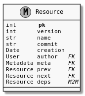

# Gestionnaire de Version

* Ce projet correspond au design technique de la résolution du ticket :
  https://github.com/PremierLangage/premierlangage/issues/204


## Objectifs globaux du projet

* Centraliser les contributions dans un endroit commun pour favoriser les mutualisations, 
  échanges et collaborations de manière générale.
* Cacher les détails techniques de sauvegarde et de pérénisation des productions pédagogiques.
* Permettre une grande flexibilité pour l'utilisateur (ici les enseignants éditeurs) dans les 
  choix de versions.
* Monter en qualité via la mise en place de version de référence pour chaque ressource 
  (à la Wikipédia).


## Versionnage

Chaque ressource est une suite de version, commençant à la version `#0`.

```text
+------------+      +------------+      +------------+
| file.txt#0 +----->+ file.txt#1 +----->+ file.txt#2 |
+------------+      +------------+      +------------+
```

A tout moment, une ressource peut être *downgrade* en plaçant une ancienne version comme nouvelle
version:

```text
                           ........................................
                           .                                      |
+------------+      +------------+      +------------+      +-----v------+
| file.txt#0 +----->+ file.txt#1 +----->+ file.txt#2 +----->+ file.txt#3 |
+------------+      +------------+      +------------+      +------------+
```

Dans les fait, la version précédente de `#3` est la version `#2` et non la version `#1`.
Un utilisateur ne verrais que:

```text
+------------+ commit1 +------------+ commit2 +------------+ downgrade to #1 +------------+
| file.txt#0 +-------->| file.txt#1 +-------->| file.txt#2 +---------------->| file.txt#3 |
+------------+         +------------+         +------------+                 +------------+
```


On peut imaginer que le saut de `#1` à la `#2` n'a pas été fait en seule séance de travail car l'auteur
à du débuguer sa ressource durant une semaine. L'utilisateur doit donc être capable de sauvegarder
une version personnelle et temporaire, il n'est pas nécessaire de garder un versionnage de la partie
local d'un utilisateur, seul sa dernière sauvegarde est gardé.

A chaque version est associé un descriptif des changements par rapport à la version précédente (*commit*).


## Conflits

Supposons que deux utilisateur, Bob et Alice, édite en même temps la même ressource, mais que Alice
sauvegarde avant Bob:

```text
                                                     Alice   +------------+
                                                        +--->+ file.txt#3 |
                                                        |    +------------+
+------------+      +------------+      +------------+  |
| file.txt#0 +----->+ file.txt#1 +----->+ file.txt#2 +--+
+------------+      +------------+      +------------+  .
                                                        .    +------------+
                                                        ...->+ file.txt#3 |
                                                       Bob   +------------+

```

Il faut alors notifier Bob qu'une modification à eu lieu entre temps, et lui laisser proposer trois
choix:

1. Abandonner ses modifications :

```text
+------------+         +------------+         +------------+   Alice   +------------+
| file.txt#0 +-------->| file.txt#1 +-------->| file.txt#2 +---------->| file.txt#3 |
+------------+         +------------+         +------------+           +------------+
```

2. Repartir depuis la nouvelle version en le laissant gérer les possibles conflits (équivalent `git rebase`)

```text
+------------+         +------------+         +------------+   Alice   +------------+    Bob    +------------+
| file.txt#0 +-------->| file.txt#1 +-------->| file.txt#2 +---------->| file.txt#3 |---------->| file.txt#4 |
+------------+         +------------+         +------------+           +------------+           +------------+
```

3. Créer un nouveau fichier avec ses modifications (*fork*):

```text
                                                      Alice  +------------+
                                                        +--->+ file.txt#3 |
                                                        |    +------------+
+------------+      +------------+      +------------+  |
| file.txt#0 +----->+ file.txt#1 +----->+ file.txt#2 +--+
+------------+      +------------+      +------------+  |
                                                        |    +--------------------+
                                                        +--->+ another_file.txt#3 |
                                                       Bob   +--------------------+

```

Dans le cas *3.*, il y a donc maintenant deux fichiers avec chacun son historique:

```text
+------------+         +------------+         +------------+   Alice   +------------+
| file.txt#0 +-------->| file.txt#1 +-------->| file.txt#2 +---------->| file.txt#3 |
+------------+         +------------+         +------------+           +------------+

+------------+         +------------+         +------------+    Bob    +--------------------+
| file.txt#0 +-------->| file.txt#1 +-------->| file.txt#2 +---------->| another_file.txt#3 |
+------------+         +------------+         +------------+           +--------------------+
```

Nous gardons ainsi nos historiques linéaires.


## Implémentation

Les ressources sont stockés dans le dossier `Yggdrasil/`. Chaque nouvelle
ressources corresponds à un sous-dossier dans `Yggdrasil/` portant le nom
de la ressource, dans lequel se situe un fichier `[name]#[version]`, par exemple:

```
Yggdrasil/
├── enantiomere
│   ├── enantiomere#0
│   └── enantiomere#1
└── fraction
    ├── fraction#0
    ├── fraction#1
    └── fraction#2
```

Chaque version possède une entrée associée dans la base de données avec la table:

.

En cas de fork, les entrées des anciennes version sont dupliqués. Pour reprendre
l'exemple ci-dessus:

```
                   +------------+         +------------+         +------------+   Alice   +------------+
                   | file.txt#0 +-------->+ file.txt#1 +-------->+ file.txt#2 +---------->+ file.txt#3 |
                   +------+-----+         +-----+------+         +-----+------+           +------+-----+
                          |                     |                      |                         |
                          |                     |                      |                         |
Yggdrasil/                |                     |                      |                         |
├── file                  |                     |                      |                         |
│   ├── file#0<-----------+                     |                      |                         |
│   ├── file#1<-----------|---------------------+                      |                         |
│   ├── file#2<-----------|---------------------|----------------------+                         |
│   └── file#3<-----------|---------------------|----------------------|-------------------------+
└── another_file          |                     |                      |
    └── another_file#3<---|---------------------|----------------------|-----------------------------+
                          |                     |                      |                             |
                          |                     |                      |                             |
                   +------+-----+         +-----+------+         +-----+------+    Bob    +----------+---------+
                   | file.txt#0 +-------->+ file.txt#1 +-------->+ file.txt#2 +---------->+ another_file.txt#3 |
                   +------------+         +------------+         +------------+           +--------------------+

```

Ainsi, seul les entrés en base de données sont dupliqué, mais non les fichiers et les metadata (celle-ci étant une clé étrangère).

